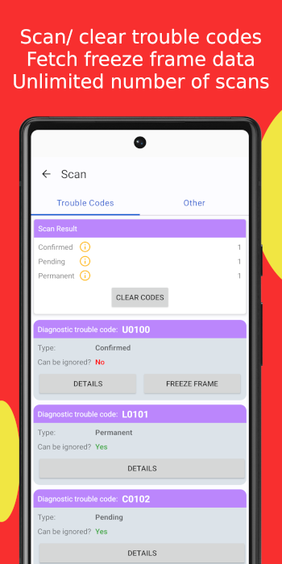
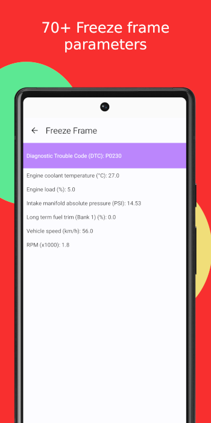
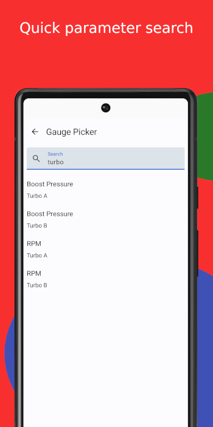
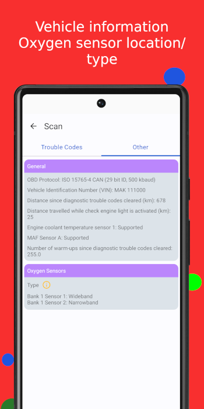
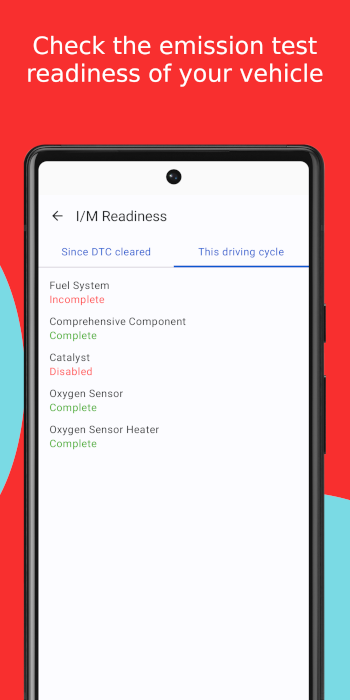

# 89 bhp
89 bhp is an Android app written in Kotlin that uses Bluetooth to communicate with a Vehicle's ECU.

## Features

### Scanner
- Quickly scan trouble codes.
- Fetch freeze frame data.
- Clear trouble codes and turn OFF check engine light.

### Inspection and Maintenance (I/M) Readiness
- View completion status of monitors needed to pass the emissions test.
- Readiness since DTC cleared.
- Readiness of the current driving cycle.

### Live Data
- Monitor parameters like speed, turbo boost etc. in real time.
- 79 parameters in total. More to be added soon.
- Fullscreen mode.
- Pinch-resizeable gauges.
- 4 gauge types to choose from.

### Vehicle Information (ECU dependent)
- Vehicle Identification Number (VIN).
- Location of Oxygen sensors.
- Type (narrowband/ wideband) of Oxygen sensors.
- Distance travelled while check engine light is activated.
- Distance travelled since DTC cleared.
- Number of warm ups since DTC cleared.
- Time run while check engine light is activated.
- Time run since DTC cleared.
- MAF/ Coolant temperature sensor support.
- Total engine run time.

Android's native UI toolkit Jetpack Compose is used for rendering the UI and Kotlin Coroutines are used for asynchronous tasks. Uses MVVM architecture.

## Screenshots

##  Android app on Google Play
